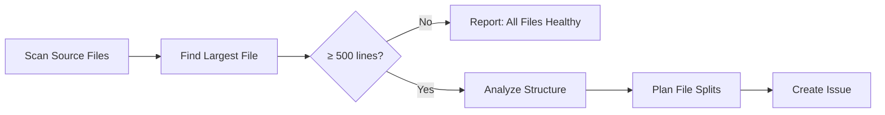

# 🗂️ Large File Simplifier

> For an overview of all available workflows, see the [main README](../README.md).

**Analyze source files to identify the largest and create an actionable refactoring issue with a detailed split plan**

The [Large File Simplifier workflow](../workflows/large-file-simplifier.md?plain=1) scans your repository for oversized source files and, when one exceeds a healthy size threshold, creates a detailed issue with a concrete plan for splitting it into smaller, focused modules.

## Installation

```bash
# Install the 'gh aw' extension
gh extension install github/gh-aw

# Add the workflow to your repository
gh aw add-wizard githubnext/agentics/large-file-simplifier
```

This walks you through adding the workflow to your repository.

## How It Works



The workflow identifies logical boundaries within the file — distinct responsibilities, related function clusters, utility code — and produces a concrete refactoring plan with proposed file names, contents, and acceptance criteria.

## What it reads from GitHub

- Repository file tree via `git ls-tree` to find source files and their sizes
- File contents to analyze structure and identify logical split points
- Existing open issues to avoid duplicate work (skip-if-match)

## What it creates

- **Issues** with detailed refactoring plans for oversized files
- Each issue targets a single file to keep work scoped
- Issues are labeled with `refactoring`, `code-health`, `automated-analysis`
- Issues auto-expire after 2 days if not actioned
- Issues are assigned to Copilot for potential automated follow-up

## What web searches it performs

This workflow does not perform web searches.

## Human in the loop

- **Review the plan**: Verify the proposed split makes logical sense for your codebase
- **Adjust boundaries**: Modify the suggested file groupings if needed before implementing
- **Implement or assign**: Perform the refactoring yourself, assign to a team member, or let Copilot handle it
- **Close if unnecessary**: Close the issue if the file is large for valid reasons

## Configuration

The workflow uses these default settings:

- **Schedule**: Weekdays
- **Threshold**: 500 lines (files under this are not flagged)
- **Target**: Each proposed new file should be under 300 lines
- **Issue labels**: `refactoring`, `code-health`, `automated-analysis`
- **Issue expiry**: 2 days if not actioned
- **Skip condition**: Does not run if a `[large-file-simplifier]` issue is already open
- **Max issues per run**: 1 (one file at a time)

## Customization

Edit the workflow source:

```bash
gh aw edit large-file-simplifier
```

Common customizations:
- **Adjust the threshold** — Change the 500-line trigger to match your team's standards
- **Focus on specific languages** — Restrict the file extension pattern to your primary language
- **Change split target** — Modify the 300-line target for proposed new files
- **Adjust schedule** — Run less frequently for stable codebases

After editing, run `gh aw compile` to update the workflow and commit to the default branch.

## Tips for Success

1. **Work the backlog gradually** — The workflow creates one issue at a time to keep things manageable
2. **Split incrementally** — Implement the refactoring one module at a time for easier review
3. **Update imports throughout** — After splitting a file, search the codebase for import paths that need updating
4. **Trust the threshold** — Files just above 500 lines may not need splitting; focus on files well over it

## Related Workflows

- [Daily File Diet](daily-file-diet.md) — Similar workflow that also creates refactoring issues for oversized files
- [Code Simplifier](code-simplifier.md) — Simplifies recently modified code for clarity
- [Duplicate Code Detector](duplicate-code-detector.md) — Finds and removes code duplication
